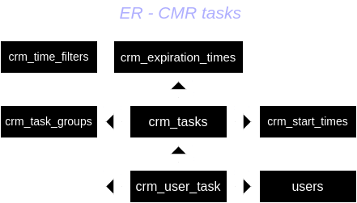

# Entity Relation Diagram

.

## Table descriptions

> start_times

Store the times where each task will start (as string options)

> task_groups

Store the groups where the tasks can be grouped.

> tasks

Store the "system tasks", tasks that will do assigned to the users
in its programmed time.

> time_filters

This table isn't related with any other, only is used to store strings
to show a selectable lists of options on tasks creation.

> user_tasks

Store the tasks assigned to each user.

> users

App users.

***

[README](../../README.md)

[Docs](../docs.md)
